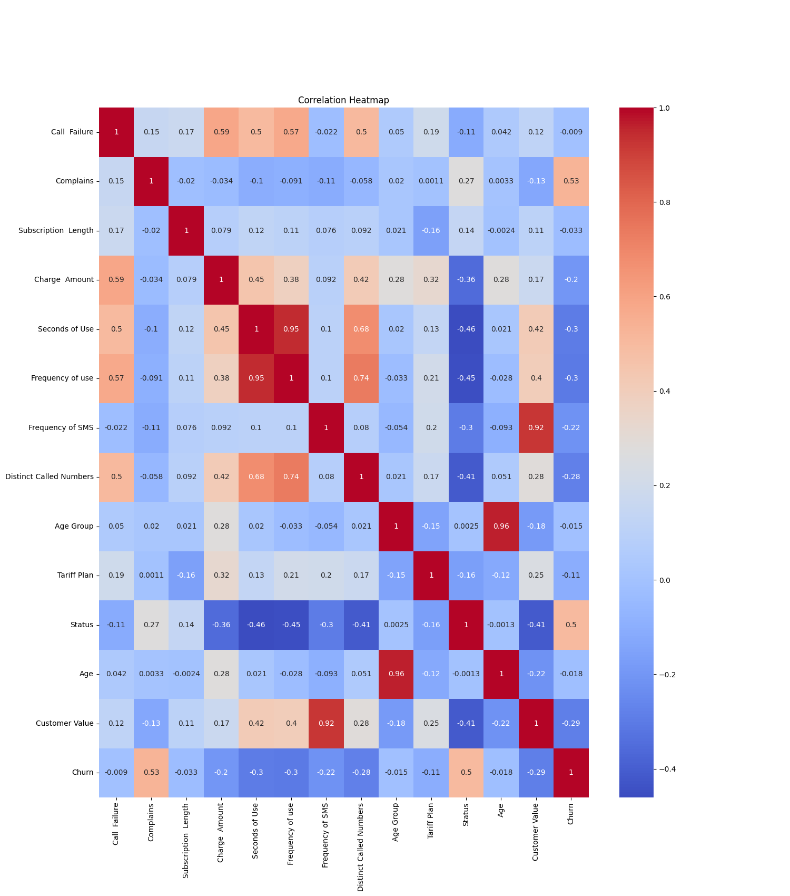
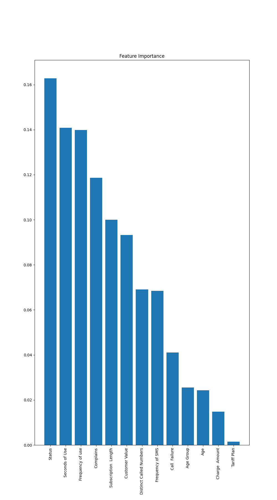
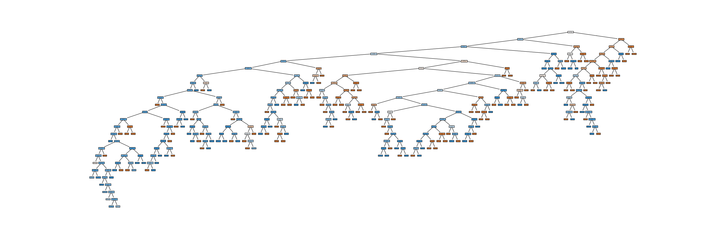

# project-2 (draft)

## Introduction

Many companies face the challenge of customers leaving their product for a competitor. For example, Adobe has lost customers to Figma. This situation can put businesses at risk and impact their growth. To address this, I wanted to explore whether it is possible to predict customer churn based on various factors collected by a company about its customers.

## Data Selection

For this project, I am using the Iranian Churn Dataset from the UC Irvine Machine Learning Repository (https://archive.ics.uci.edu/dataset/563/iranian+churn+dataset). The dataset contains 3,150 customer records with 13 features, including call failures, complaints, subscription length, charge amount, seconds of use, frequency of use, frequency of SMS, distinct called numbers, age group, service type, and customer value. All attributes are aggregated over the first 9 months, while the churn label reflects the customer’s status at the end of 12 months, leaving a 3-month planning gap.

## Data Preprocessing

### Separate Churn

In supervised learning, we need to separate Independent variables that describe the customer (age, usage, complaints, etc) from what we want to predict. Splits the dataset into X where all columns except "churn" and y with "churn" column.

### Train-Test Split

We split into training (80%) and testing (20%) sets so we can evaluate how well the model generalizes to unseen data. we need to ensure that the same churn/non-churn ratio in both train and test sets (important for imbalanced datasets).

## Data visualization

This is the data corelation with data among the table attributes.

Shows relationships between dataset features and churn.

## Modeling

I used random forest as my model to predict customer churn. This model is a machine learning algorithm that uses many decision trees to make better predictions. Each tree looks at different random parts of the data and their results are combined by voting for classification or averaging for regression which makes it as ensemble learning technique. This helps in improving accuracy and reducing errors. 

### Pros of Random Forester

<ul>
    <li>Random Forest provides very accurate predictions even with large datasets.</li>
    <li>Random Forest can handle missing data well without compromising with accuracy.</li>
    <li>It doesn’t require normalization or standardization on dataset.</li>
    <li>When we combine multiple decision trees it reduces the risk of overfitting of the model.</li>
</ul>

### Cons of Random Forester

<ul>
    <li>It can be computationally expensive especially with a large number of trees.</li>
    <li>It’s harder to interpret the model compared to simpler models like decision trees.</li>
</ul>

## Evaluation of Model

## What I Found

(you can see the full image in the <a href="decision_tree.pdf">decision_tree.pdf</a>)

## Impact

## References

<ul>
    <li>Dataset: https://archive.ics.uci.edu/dataset/563/iranian+churn+dataset</li>
    <li>Model Information: https://www.geeksforgeeks.org/machine-learning/random-forest-algorithm-in-machine-learning/</li>
    <li>Coding Help: Chat GPT</li>
</ul>